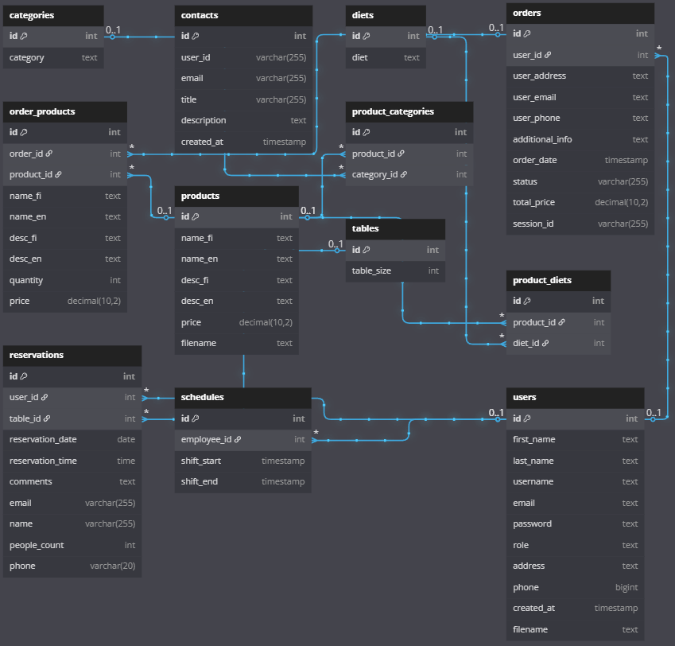

[](https://www.codefactor.io/repository/github/jarkkokarki/web-project-backend)  
[](https://10.120.32.87/app)  
[](https://jarkkokarki.github.io/Web-Project-Backend/)

# 🖥️ Web-Project-Backend

## 📑 Table of Contents

- [📌 Overview](#overview)
- [✨ Features](#features)
- [🛠️ Tech Stack](#tech-stack)
- [🚀 Getting Started](#getting-started)
- [🔐 Environment Variables](#environment-variables)
- [📜 Scripts](#scripts)
- [📘 API Documentation](#api-documentation)
- [📁 Project Structure](#project-structure)
- [🌐 Main Endpoints](#main-endpoints)
- [🧪 Testing the API](#testing-the-api)
- [🪪 License](#license)
- [🗄️ Database](#database)

---

## 📌 Overview

This is a Node.js/Express backend for a web application providing a RESTful API for:

👤 user management, <br>
🔐 authentication, <br>
📋 menu management, <br>
🛒 orders, <br>
📅 reservations, <br>
💳 Stripe payments, <br>
✉️ contact messages, and 🗺️ route calculations via Digitransit API. <br>
Supports multi-language <br>
🈯️ menu items, JWT-based auth, and secure transactions. <br>

---

## ✨ Features

- 👤 User registration, login, profile & JWT-based auth
- 🛡️ Admin/user roles with access control
- 🧾 Menu CRUD (categories, diets, images)
- 📦 Order management (user & admin views)
- 📅 Reservation system with availability checks
- 💳 Stripe payments integration
- 📬 Contact form/message handling
- 🚏 Route & leg data from Digitransit API
- 🧪 API documentation (apidoc, jsdoc)
- 🖼️ File uploads (profile/menu images)
- 🌍 Multi-language support (EN 🇬🇧 / FI 🇫🇮)
- ⚙️ Config via environment variables

---

## 🛠️ Tech Stack

- 🟩 Node.js  
- ⚡ Express.js  
- 🐬 MySQL (mysql2)  
- 🔐 JWT (jsonwebtoken)  
- 💳 Stripe API  
- 📤 Multer (file uploads)  
- 🖼️ Sharp (image processing)  
- 🌱 dotenv  
- 📝 apidoc & jsdoc  
- 🧭 Digitransit API  
- 🌐 CORS

---

## 🚀 Getting Started

### 1. 🧬 Clone the Repository

```sh
git clone https://github.com/JarkkoKarki/Web-Project-Backend.git
```

### 2. 📂 Navigate to the Project Directory

```sh
cd Web-Project-Backend
```

### 3. 📦 Install Dependencies

```sh
npm install
```

### 4. ✏️ Configure Environment

```env
DB_HOST=your_db_host
DB_USER=your_db_user
DB_PASSWORD=your_db_password
DB_NAME=your_db_name

JWT_SECRET=your_jwt_secret
DIGITRANSIT_SUBSCRIPTION_KEY=your_digitransit_key
STRIPE_SECRET_KEY=your_stripe_secret_key
STRIPE_PUBLIC_KEY=your_stripe_public_key
```

### 5. ▶️ Start the Development Server

```sh
npm run dev
```

📍 The server will run at: http://127.0.0.1:3000

---

## 📜 Scripts

```sh
npm start
```
— 🔁 Start the server

```sh
npm run dev
```
— 🔄 Start with nodemon (auto-reload)

```sh
npm run docs
```
— 📘 Generate JSDoc

```sh
npm run generate-docs
```
— 📗 Generate API docs with apidoc

```sh
npm run deploy-docs
```
— 🚀 Deploy docs to GitHub Pages

---

## 📘 API Documentation

- Local API Docs: `http://localhost:3000/apidoc`
- Main API Routes: `http://localhost:3000/`

---

## 📁 Project Structure

```
📦 Web-Project-Backend/
├── 📂 apidoc/
├── 📂 public/
├── 📂 src/
│   ├── app.js
│   ├── index.js
│   ├── 📂 api/
│   │   ├── controllers/
│   │   ├── models/
│   │   ├── routes/
│   │   ├── middlewares/
│   │   └── index.js
│   ├── 📂 rest/
│   └── 📂 utils/
├── 📂 uploads/
├── .env
├── .env.sample
├── package.json
├── README.md
```

---

## 🌐 Main Endpoints

### 👤 Users
- `GET /api/users`
- `POST /api/users`
- `PUT /api/users/:id`
- `DELETE /api/users/:id`

### 🔐 Auth
- `POST /api/auth/login`
- `POST /api/auth/register`
- `GET /api/auth/me`
- `GET /api/auth/logout`

### 🍽️ Menu
- `GET /api/menu`
- `POST /api/menu`
- `PUT /api/menu/:id`
- `DELETE /api/menu/:id`

### 🛒 Orders
- `GET /api/orders/:lang`
- `POST /api/orders`
- `PUT /api/orders/:id`

### 📅 Reservations
- `GET /api/reservations`
- `POST /api/reservations/reserve`
- `DELETE /api/reservations/:reservationId`

### 💳 Payments
- `POST /api/payment/create-checkout-session`

### ✉️ Contact
- `POST /api/contact`
- `GET /api/contact`
- `DELETE /api/contact/:id`

### 🧭 Route
- `GET /api/route/:olat/:olng/:lat/:lng`
- `GET /api/route/legs/:olat/:olng/:lat/:lng`

---

## 🧪 Testing the API

Use:
- 📄 `.rest` files in `src/rest/` (with [REST Client for VSCode](https://marketplace.visualstudio.com/items?itemName=humao.rest-client))
- 🧪 Postman / Insomnia / cURL

Sample HTML request/response examples in: `public/html/document.html`

---

## 🔐 Environment Variables

```env
DB_HOST=your_db_host
DB_USER=your_db_user
DB_PASSWORD=your_db_password
DB_NAME=your_db_name
JWT_SECRET=your_jwt_secret
DIGITRANSIT_SUBSCRIPTION_KEY=your_digitransit_key
STRIPE_SECRET_KEY=your_stripe_secret_key
STRIPE_PUBLIC_KEY=your_stripe_public_key
```

---

## 🗄️ Database

📊 Database schema designed for all core modules (users, orders, reservations, etc.)



<details>
  <summary>Click to expand full SQL schema 📄</summary>

```sql
SET SQL_MODE = "NO_AUTO_VALUE_ON_ZERO";
START TRANSACTION;
SET time_zone = "+00:00";

/*!40101 SET @OLD_CHARACTER_SET_CLIENT=@@CHARACTER_SET_CLIENT */;
/*!40101 SET @OLD_CHARACTER_SET_RESULTS=@@CHARACTER_SET_RESULTS */;
/*!40101 SET @OLD_COLLATION_CONNECTION=@@COLLATION_CONNECTION */;
/*!40101 SET NAMES utf8mb4 */;


CREATE TABLE `categories` (
  `id` int(11) NOT NULL,
  `category` text NOT NULL
) ENGINE=InnoDB DEFAULT CHARSET=utf8 COLLATE=utf8_general_ci;

CREATE TABLE `contacts` (
  `id` int(11) NOT NULL,
  `user_id` varchar(255) DEFAULT NULL,
  `email` varchar(255) NOT NULL,
  `title` varchar(255) NOT NULL,
  `description` text NOT NULL,
  `created_at` timestamp NOT NULL DEFAULT current_timestamp()
) ENGINE=InnoDB DEFAULT CHARSET=utf8 COLLATE=utf8_general_ci;

CREATE TABLE `diets` (
  `id` int(11) NOT NULL,
  `diet` text NOT NULL
) ENGINE=InnoDB DEFAULT CHARSET=utf8 COLLATE=utf8_general_ci;

CREATE TABLE `orders` (
  `id` int(11) NOT NULL,
  `user_id` int(11) DEFAULT NULL,
  `user_address` text NOT NULL,
  `user_email` text DEFAULT NULL,
  `user_phone` text DEFAULT NULL,
  `additional_info` text DEFAULT NULL,
  `order_date` timestamp NOT NULL DEFAULT current_timestamp(),
  `status` varchar(255) NOT NULL DEFAULT 'pending',
  `total_price` decimal(10,2) NOT NULL,
  `session_id` varchar(255) DEFAULT NULL
) ENGINE=InnoDB DEFAULT CHARSET=utf8 COLLATE=utf8_general_ci;

CREATE TABLE `order_products` (
  `id` int(11) NOT NULL,
  `order_id` int(11) NOT NULL,
  `product_id` int(11) DEFAULT NULL,
  `name_fi` text CHARACTER SET utf8 COLLATE utf8_general_mysql500_ci DEFAULT NULL,
  `name_en` text DEFAULT NULL,
  `desc_fi` text DEFAULT NULL,
  `desc_en` text DEFAULT NULL,
  `quantity` int(11) NOT NULL,
  `price` decimal(10,2) DEFAULT NULL
) ENGINE=InnoDB DEFAULT CHARSET=utf8 COLLATE=utf8_general_ci;

CREATE TABLE `products` (
  `id` int(11) NOT NULL,
  `name_fi` text NOT NULL,
  `name_en` text NOT NULL,
  `desc_fi` text NOT NULL,
  `desc_en` text NOT NULL,
  `price` decimal(10,2) NOT NULL,
  `filename` text NOT NULL
) ENGINE=InnoDB DEFAULT CHARSET=utf8 COLLATE=utf8_general_ci;

CREATE TABLE `product_categories` (
  `id` int(11) NOT NULL,
  `product_id` int(11) NOT NULL,
  `category_id` int(11) NOT NULL
) ENGINE=InnoDB DEFAULT CHARSET=utf8 COLLATE=utf8_general_ci;

CREATE TABLE `product_diets` (
  `id` int(11) NOT NULL,
  `product_id` int(11) NOT NULL,
  `diet_id` int(11) NOT NULL
) ENGINE=InnoDB DEFAULT CHARSET=utf8 COLLATE=utf8_general_ci;

CREATE TABLE `reservations` (
  `id` int(11) NOT NULL,
  `user_id` int(11) DEFAULT NULL,
  `table_id` int(11) NOT NULL,
  `reservation_date` date NOT NULL,
  `reservation_time` time NOT NULL,
  `comments` text DEFAULT NULL,
  `email` varchar(255) DEFAULT NULL,
  `name` varchar(255) DEFAULT NULL,
  `people_count` int(11) NOT NULL,
  `phone` varchar(20) DEFAULT NULL
) ENGINE=InnoDB DEFAULT CHARSET=utf8 COLLATE=utf8_general_ci;

CREATE TABLE `schedules` (
  `id` int(11) NOT NULL,
  `employee_id` int(11) NOT NULL,
  `shift_start` timestamp NOT NULL DEFAULT '0000-00-00 00:00:00' ON UPDATE current_timestamp(),
  `shift_end` timestamp NOT NULL DEFAULT '0000-00-00 00:00:00'
) ENGINE=InnoDB DEFAULT CHARSET=utf8 COLLATE=utf8_general_ci;

CREATE TABLE `tables` (
  `id` int(11) NOT NULL,
  `table_size` int(11) NOT NULL
) ENGINE=InnoDB DEFAULT CHARSET=utf8 COLLATE=utf8_general_ci;

CREATE TABLE `users` (
  `id` int(11) NOT NULL,
  `first_name` text DEFAULT NULL,
  `last_name` text DEFAULT NULL,
  `username` text NOT NULL,
  `email` text NOT NULL,
  `password` text NOT NULL,
  `role` text NOT NULL DEFAULT 'user',
  `address` text DEFAULT NULL,
  `phone` bigint(20) DEFAULT NULL,
  `created_at` timestamp NOT NULL DEFAULT current_timestamp(),
  `filename` text NOT NULL
) ENGINE=InnoDB DEFAULT CHARSET=utf8 COLLATE=utf8_general_ci;


ALTER TABLE `categories`
  ADD PRIMARY KEY (`id`);

ALTER TABLE `contacts`
  ADD PRIMARY KEY (`id`);

ALTER TABLE `diets`
  ADD PRIMARY KEY (`id`);

ALTER TABLE `orders`
  ADD PRIMARY KEY (`id`),
  ADD KEY `user_id` (`user_id`);

ALTER TABLE `order_products`
  ADD PRIMARY KEY (`id`),
  ADD KEY `order_id` (`order_id`),
  ADD KEY `product_id` (`product_id`);

ALTER TABLE `products`
  ADD PRIMARY KEY (`id`);

ALTER TABLE `product_categories`
  ADD PRIMARY KEY (`id`),
  ADD KEY `product_id` (`product_id`),
  ADD KEY `category_id` (`category_id`);

ALTER TABLE `product_diets`
  ADD PRIMARY KEY (`id`),
  ADD KEY `product_id` (`product_id`),
  ADD KEY `diet_id` (`diet_id`);

ALTER TABLE `reservations`
  ADD PRIMARY KEY (`id`),
  ADD KEY `user_id` (`user_id`),
  ADD KEY `table_id` (`table_id`);

ALTER TABLE `schedules`
  ADD PRIMARY KEY (`id`),
  ADD KEY `employee_id` (`employee_id`);

ALTER TABLE `tables`
  ADD PRIMARY KEY (`id`);

ALTER TABLE `users`
  ADD PRIMARY KEY (`id`);


ALTER TABLE `categories`
  MODIFY `id` int(11) NOT NULL AUTO_INCREMENT;

ALTER TABLE `contacts`
  MODIFY `id` int(11) NOT NULL AUTO_INCREMENT;

ALTER TABLE `diets`
  MODIFY `id` int(11) NOT NULL AUTO_INCREMENT;

ALTER TABLE `orders`
  MODIFY `id` int(11) NOT NULL AUTO_INCREMENT;

ALTER TABLE `order_products`
  MODIFY `id` int(11) NOT NULL AUTO_INCREMENT;

ALTER TABLE `products`
  MODIFY `id` int(11) NOT NULL AUTO_INCREMENT;

ALTER TABLE `product_categories`
  MODIFY `id` int(11) NOT NULL AUTO_INCREMENT;

ALTER TABLE `product_diets`
  MODIFY `id` int(11) NOT NULL AUTO_INCREMENT;

ALTER TABLE `reservations`
  MODIFY `id` int(11) NOT NULL AUTO_INCREMENT;

ALTER TABLE `schedules`
  MODIFY `id` int(11) NOT NULL AUTO_INCREMENT;

ALTER TABLE `tables`
  MODIFY `id` int(11) NOT NULL AUTO_INCREMENT;

ALTER TABLE `users`
  MODIFY `id` int(11) NOT NULL AUTO_INCREMENT;


ALTER TABLE `orders`
  ADD CONSTRAINT `orders_ibfk_1` FOREIGN KEY (`user_id`) REFERENCES `users` (`id`) ON DELETE SET NULL;

ALTER TABLE `order_products`
  ADD CONSTRAINT `fk_order_products_order_id` FOREIGN KEY (`order_id`) REFERENCES `orders` (`id`),
  ADD CONSTRAINT `order_products_ibfk_1` FOREIGN KEY (`product_id`) REFERENCES `products` (`id`) ON DELETE SET NULL;

ALTER TABLE `product_categories`
  ADD CONSTRAINT `fk_product_categories_category_id` FOREIGN KEY (`category_id`) REFERENCES `categories` (`id`),
  ADD CONSTRAINT `fk_product_categories_product_id` FOREIGN KEY (`product_id`) REFERENCES `products` (`id`);

ALTER TABLE `product_diets`
  ADD CONSTRAINT `fk_product_diets_diet_id` FOREIGN KEY (`diet_id`) REFERENCES `diets` (`id`),
  ADD CONSTRAINT `fk_product_diets_product_id` FOREIGN KEY (`product_id`) REFERENCES `products` (`id`);

ALTER TABLE `reservations`
  ADD CONSTRAINT `fk_reservations_table_id` FOREIGN KEY (`table_id`) REFERENCES `tables` (`id`),
  ADD CONSTRAINT `reservations_ibfk_1` FOREIGN KEY (`user_id`) REFERENCES `users` (`id`) ON DELETE SET NULL;

ALTER TABLE `schedules`
  ADD CONSTRAINT `fk_schedules_employee_id` FOREIGN KEY (`employee_id`) REFERENCES `users` (`id`);
COMMIT;

/*!40101 SET CHARACTER_SET_CLIENT=@OLD_CHARACTER_SET_CLIENT */;
/*!40101 SET CHARACTER_SET_RESULTS=@OLD_CHARACTER_SET_RESULTS */;
/*!40101 SET COLLATION_CONNECTION=@OLD_COLLATION_CONNECTION */;

```
</details>

---
